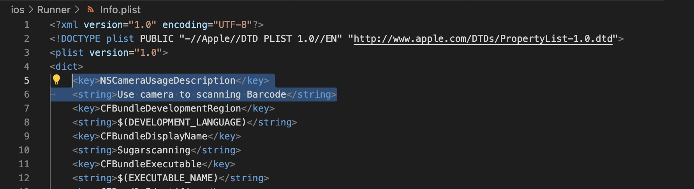
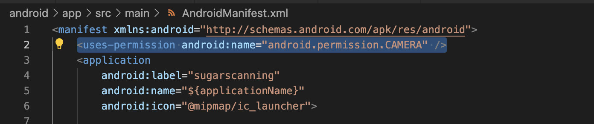
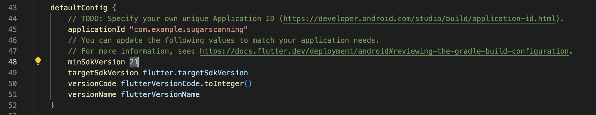
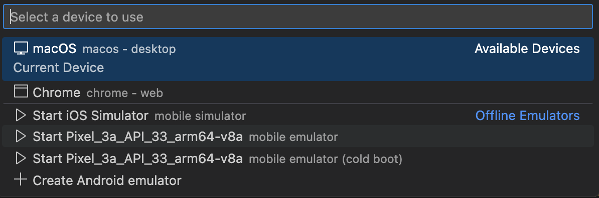

# sparklingapp

SParklingAPP is an internship program at UoA. It is an app that helps users control their sugar intake.

## Environment Setup:

Refer to the official configuration to install the Flutter environment: Flutter Installation Guide
Project Initialization:

## Clone the project to your local machine:
```
git clone git@github.com:UOA-COMPCSI778-LY-2023/sparklingapp.git
```
## Initialize the project:
```
cd sparklingapp
flutter create .
```
## Configure APP Permissions:

### iOS:
In the path ./sparklingapp/ios/Runner, add the following value to the "dict" key in the Info.plist file:
```
<key>NSCameraUsageDescription</key>
<string>Use camera to scanning Barcode</string>
```


### Android:
In the path ./sparklingapp/android/app/src/main, add the following value to the "manifest" key in the AndroidManifest.xml file:
```
<uses-permission android:name="android.permission.CAMERA" />
```

In the path ./sparklingapp/android/app, modify the "flutter.minSdkVersion" in "build.gradle" file under defaultConfig to 21


## Start the Emulator:



## Project Launch:
```
flutter run
```