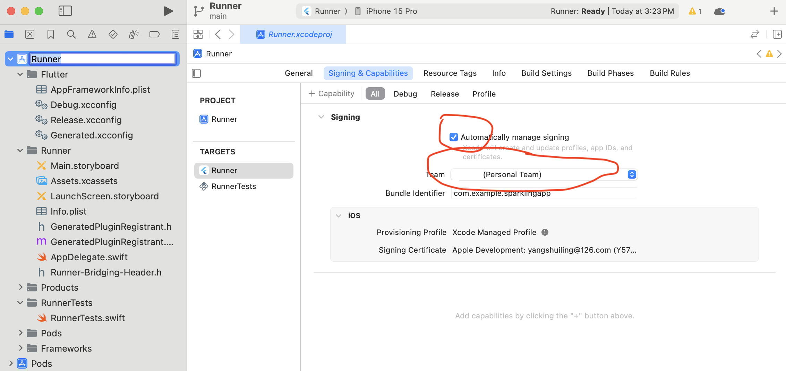

# Sparklingapp

SParklingAPP is an internship program at UoA. It is an app that helps users control their sugar intake.

## Environment Setup:

Refer to the official configuration to install the Flutter environment: Flutter Installation Guide
Project Initialization:

## Clone the project to your local machine:
```
git clone git@github.com:UOA-COMPCSI778-LY-2023/sparklingapp.git
```
## Initialize the project:
```
cd sparklingapp
flutter create .
```
## Configure APP Permissions:

### iOS:
In the path ./sparklingapp/ios/Runner, add the following value to the "dict" key in the Info.plist file:
```
<key>NSCameraUsageDescription</key>
<string>Use camera to scanning Barcode</string>
```

Use xcode to open the file Runner.xcworkspace under the path . /sparklingapp/ios under the file Runner.xcworkspace. In the xcode project manager, set the minimum system version to 14.

Then in xcode, set the developer account to the Apple account you are currently logged into in macOS.


### Android:
In the path ./sparklingapp/android/app/src/main, add the following value to the "manifest" key in the AndroidManifest.xml file:
```
<uses-permission android:name="android.permission.CAMERA" />
```

In the path ./sparklingapp/android/app, modify the "flutter.minSdkVersion" in "build.gradle" file under defaultConfig to 21


## Configure the debug mode:
The DebugCfg class in the path lib/Configuration/Global.dart file is used to configure debugging-related configuration. If isDebug is true, it means the camera is currently in debug mode; false is not debug mode. In debug mode, the camera will automatically switch to support reading photos from albums.
When running on a cell phone, it is recommended to set idDebug to false.


## Start the Emulator:


## Project Launch:
```
flutter run
```